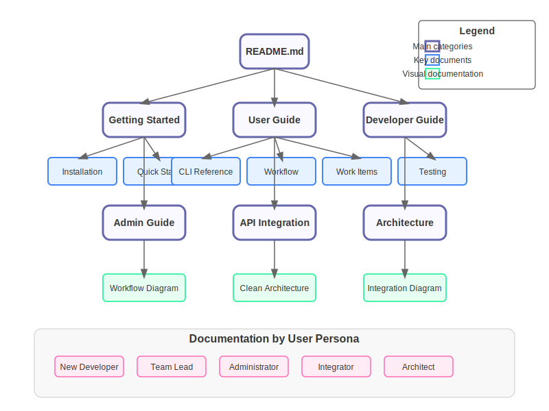
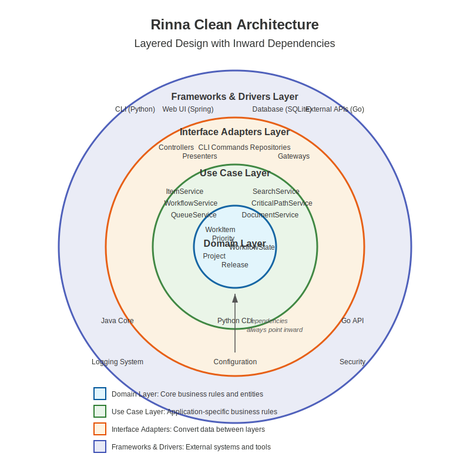
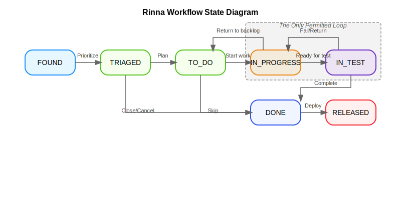
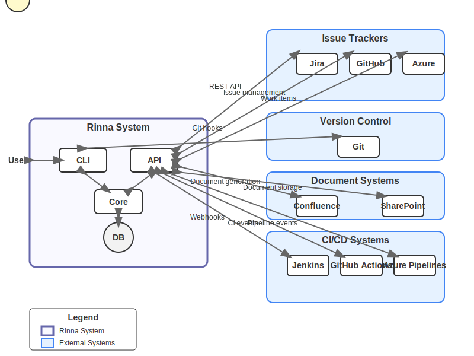

# Rinna Documentation

Welcome to the Rinna documentation. Rinna is a developer-centric workflow management system designed to reduce process overhead while maximizing productivity.



> 💡 **Rinna Philosophy**: Rinna isn't trying to replace enterprise tools – it exists to make workflow management work _for_ developers rather than the other way around. It brings workflow management to where developers actually work: the command line.

## Documentation By User Persona

### For New Developers 🚀
You're new to Rinna and need to get started quickly:

- [Quick Start Guide](getting-started/README.md) - Install and set up your first project in minutes
- [CLI Basics](user-guide/rin-quick-reference.md) - Essential commands for daily use
- [Workflow Overview](user-guide/workflow.md) - Understanding Rinna's streamlined workflow
- [First Work Item](getting-started/first-work-item.md) - Create and manage your first task

### For Experienced Developers 💻
You're familiar with development workflows and want to maximize efficiency:

- [CLI Reference](user-guide/rin-cli.md) - Complete command-line interface documentation
- [TUI Requirements](user-guide/tui-requirements.md) - Text User Interface specifications
- [Work Item Management](user-guide/work-item-relationships.md) - Managing dependencies and relationships
- [Test-Driven Development](user-guide/README.md#test-driven-development-workflow) - Using Rinna for effective TDD
- [Document Generation](user-guide/documents.md) - Creating reports and documentation
- [Development Guide](development/README.md) - Contributing to Rinna

### For Team Leads 👨‍💼👩‍💼
You're managing a team and need tools for coordination and oversight:

- [Release Management](user-guide/releases.md) - Planning and tracking releases
- [Lota Management](user-guide/lota.md) - Managing development cycles
- [Metrics and Reporting](user-guide/metrics/it-workflow-metrics.md) - Team productivity insights
- [Critical Path Analysis](user-guide/README.md#critical-path-analysis) - Identifying bottlenecks
- [Migration Guide](user-guide/migration/README.md) - Transitioning from other tools

### For Administrators 🔧
You're responsible for setting up and maintaining Rinna:

- [Admin Guide](user-guide/admin-guide.md) - Complete administration guide
- [Server Configuration](user-guide/admin-server-setup.md) - Deployment and configuration
- [Admin CLI Quick Start](user-guide/admin-cli-quickstart.md) - Essential admin commands
- [Backup and Recovery](user-guide/service-management.md) - Protecting your data
- [Security Setup](development/configuration.md) - Securing your Rinna installation

### For System Integrators 🔄
You need to connect Rinna with other systems in your environment:

- [API Reference](user-guide/api-integration.md) - RESTful API documentation
- [Enterprise Integration](user-guide/api-integration.md) - Connecting with external systems
- [Migration Guide](user-guide/migration/README.md) - Data migration strategies
- [Webhook Configuration](user-guide/api-integration.md#webhook-integration) - Event-based integration

### For Architects 🏗️
You're interested in Rinna's technical architecture and design decisions:

- [Architecture Overview](development/architecture.md) - Technical design and principles
- [Clean Architecture Implementation](development/package-structure.md) - How Rinna implements Clean Architecture
- [Architecture Decisions](architecture/decisions/README.md) - Recorded architecture decisions
- [Engineering Specification](specifications/engineering_spec.md) - Detailed system design

## Core Concepts

For a complete reference of all terms and concepts, see the [Glossary and Conceptual Index](glossary.md).


### Clean Architecture

Rinna follows the Clean Architecture approach, organizing the system into concentric layers with dependencies pointing inward:



1. **Domain Layer (Core)**: Business entities and enterprise business rules
2. **Use Case Layer**: Application-specific business rules
3. **Interface Adapters Layer**: Converts data between different formats
4. **Frameworks & Drivers Layer**: External frameworks and tools

[Learn more about Rinna's architecture](development/architecture.md)

### The Native Developer Workflow

Rinna uses a deliberate, opinionated workflow model that represents the smallest set of states needed for effective software development:



```
Found → Triaged → To Do → In Progress → In Test → Done
```

Can you customize the workflow? No, you can't. [That's the point](user-guide/workflow-philosophy.md).

### Enterprise Integration

Rinna integrates with various external systems through a flexible adapter-based architecture:



Integration points include:
- Issue tracking systems (Jira, GitHub Issues, Azure DevOps)
- Version control systems (Git)
- Document systems (Confluence, SharePoint)
- CI/CD systems (Jenkins, GitHub Actions, Azure Pipelines)

[Learn more about enterprise integration](user-guide/api-integration.md)

### Work Item Types

- **Goal**: High-level objectives that orient development efforts
- **Feature**: Incremental functionality that delivers user value
- **Bug**: Software issues requiring correction
- **Chore**: Non-functional maintenance tasks

### Work Items and Dependencies

Understanding relationships between work items is crucial for effective project management:

- [Dependencies and Relationships](user-guide/work-item-relationships.md) - How work items relate to and affect each other

### Developer-Focused, Enterprise-Compatible

Rinna is designed primarily for developers, but it can integrate with enterprise requirements:

- Work locally in Rinna's clean, efficient workflow
- Map to enterprise tools when needed for reporting
- Satisfy management requirements without complicating development

## Why Rinna?

Traditional project management tools are designed primarily for reporting to management. Rinna takes the opposite approach:

- **Lives Where Developers Work**: Terminal-first interface in your coding environment
- **Zero-Friction Philosophy**: Never adds more process than absolutely necessary
- **Developer-Owned**: Complete workflow control by the people doing the work
- **Clear Visibility**: Simple, unambiguous work item tracking without the noise

## Getting Started

Ready to dive in? Here are the quickest paths to get started with Rinna:

1. [Installation Guide](getting-started/README.md) - Set up Rinna in your environment
2. [CLI Quick Reference](user-guide/rin-quick-reference.md) - Essential commands to get started
3. [First Project Setup](user-guide/admin-cli-quickstart.md) - Create your first Rinna project
4. [Creating Work Items](user-guide/rin-cli.md#standard-work-item-commands) - Start tracking your work

## Complete Documentation Map

- [Getting Started](getting-started/README.md)
  - Installation
  - Quick start guide
  - First steps with Rinna
  - Java 21 features

- [User Guide](user-guide/README.md)
  - [CLI Tool](user-guide/rin-cli.md)
  - [CLI Quick Reference](user-guide/rin-quick-reference.md)
  - [Work Item Management](user-guide/README.md#work-item-management)
  - [Service Management](user-guide/service-management.md)
  - [Configuration](user-guide/configuration-reference.md)
  - [Workflow](user-guide/workflow.md)
  - [Workflow Philosophy](user-guide/workflow-philosophy.md)
  - [Work Item Relationships](user-guide/work-item-relationships.md)
  - [Lota (Development Cycle)](user-guide/lota.md)
  - [Release Management](user-guide/releases.md)
  - [Document Generation](user-guide/documents.md)
  - [Migration Guide](user-guide/migration/README.md)
    - [Jira Migration](user-guide/migration/jira-migration.md)
    - [Azure DevOps Migration](user-guide/migration/azure-devops-migration.md)
    - [GitHub Issues Migration](user-guide/migration/github-issues-migration.md)
  
- [Administrator Guide](user-guide/admin-guide.md)
  - [Admin CLI Quick Start](user-guide/admin-cli-quickstart.md)
  - [Server Setup](user-guide/admin-server-setup.md)
  - [Integration Configuration](user-guide/api-integration.md)
  - [Maven POM Sample](user-guide/admin-pom-sample.xml)

- [Development](development/README.md)
  - [Architecture](development/architecture.md)
  - [Design Approach](development/design-approach.md)
  - [Package Structure](development/package-structure.md)
  - [Version Management](development/version-management.md)
  - [Java 21 Features](development/java21-features.md)
  - [Testing Strategy](development/testing.md)
  - [Contributing](development/contribution.md)

- [Specifications](specifications/engineering_spec.md)
  - [Technical Requirements](technical-specification.md)
  - [System Design](specifications/engineering_spec.md)
  - [Integration Points](user-guide/api-integration.md)

- [Architecture Decisions](architecture/decisions/README.md)
  - [Record Architecture Decisions](architecture/decisions/0001-record-architecture-decisions.md)
  - [Automated C4 Architecture Diagrams](architecture/decisions/0002-automated-c4-architecture-diagrams.md)
  - [Adopt Clean Architecture](architecture/decisions/0003-adopt-clean-architecture-for-system-design.md)
  - [Package Structure Refactoring](architecture/decisions/0004-refactor-package-structure-to-align-with-clean-architecture.md)
  - [Multi-Language Approach](architecture/decisions/0005-adopt-multi-language-approach-for-system-components.md)
  - [Testing Pyramid Strategy](architecture/decisions/0006-implement-comprehensive-testing-pyramid-strategy.md)
  - [Security Compliance Framework](architecture/decisions/0007-establish-security-compliance-framework.md)

- [Visual Documentation](diagrams/README.md)
  - [Workflow Diagram](diagrams/workflow/workflow_state_diagram.md)
  - [Clean Architecture Diagram](diagrams/architecture/clean_architecture_diagram.md)
  - [Enterprise Integration Diagram](diagrams/integration/enterprise_integration_diagram.md)
  - [Documentation Structure](diagrams/documentation_structure.md)
  - [C4 Diagrams](diagrams/README.md#c4-model-diagrams)

## Need Help?

- Check the [CLI Commands Reference](CLAUDE.md) for a complete list of available commands
- Join our community forum at [community.rinna.org](https://community.rinna.org)
- Submit issues or feature requests on [GitHub](https://github.com/heymumford/rinna/issues)
- Contact support at support@rinna.org