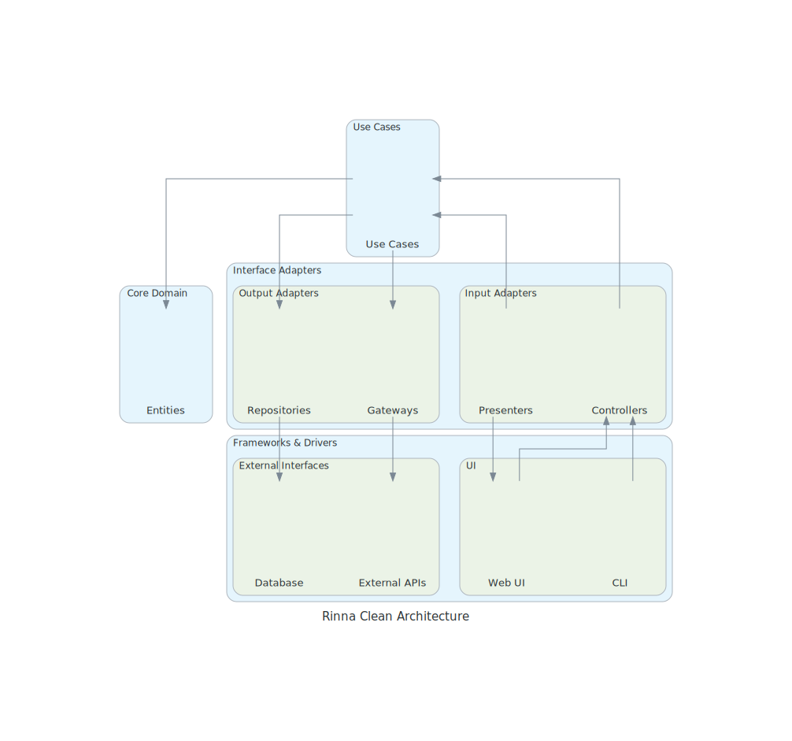

# 3. Adopt Clean Architecture for System Design

Date: 2025-04-06

## Status

Accepted

## Context

As the Rinna project evolves, we need to establish a clear architectural approach that will guide our development and help maintain a high-quality, maintainable codebase. Without a well-defined architecture, we risk:

1. Tightly coupled components that are difficult to modify
2. Business logic scattered throughout the application
3. Framework dependencies leaking into domain logic
4. Testing becoming increasingly difficult
5. New team members struggling to understand the system

We need an architecture that:
- Clearly separates concerns
- Isolates business logic from external dependencies
- Enables independent testing of components
- Allows technical decisions to be deferred or changed with minimal impact
- Is understandable and provides a consistent mental model

## Decision

We will adopt the Clean Architecture approach (as described by Robert C. Martin) for designing the Rinna system. This architectural approach organizes code into concentric layers, with dependencies only pointing inward toward the domain layer.

The layers of the architecture will be:

1. **Domain/Entity Layer (Core)**
   - Contains business entities and core domain logic
   - Has no dependencies on other layers or external frameworks
   - Defines interfaces that outer layers must implement

2. **Use Case/Application Layer**
   - Contains application-specific business rules
   - Orchestrates the flow of data to and from entities
   - Defines interfaces for external dependencies
   - Depends only on the domain/entity layer

3. **Interface Adapter Layer**
   - Converts data between formats suitable for use cases and external frameworks
   - Includes controllers, presenters, gateways and repositories
   - Depends on use case and domain layers

4. **Infrastructure/Frameworks Layer**
   - Contains frameworks, tools, and external systems
   - Implements interfaces defined by inner layers
   - Handles database access, UI, external APIs, etc.

The package structure will reflect this layered approach:
- `org.rinna.domain`: Core domain entities and business rules
- `org.rinna.usecase`: Application-specific business rules
- `org.rinna.adapter`: Interface adapters (repositories, controllers)
- `org.rinna.infrastructure`: External frameworks and tools

We will enforce the dependency rule rigorously: source code dependencies must point only inward, with nothing in an inner circle knowing anything about an outer circle.

*Figure: Visualization of the Clean Architecture layers and dependencies*

## Consequences

Adopting Clean Architecture has the following consequences:

### Positive
1. **Separation of concerns**: Business logic is isolated from UI, database, and external concerns
2. **Testability**: Core business logic can be tested without external dependencies
3. **Flexibility**: External frameworks and tools can be replaced with minimal impact on business logic
4. **Independence**: Development work can proceed with fewer dependencies between teams
5. **Focus on domain**: The architecture emphasizes the business domain over technical implementations
6. **Clear boundaries**: Well-defined interfaces between layers make the system easier to understand

### Challenges
1. **Learning curve**: Team members will need to understand the architectural principles
   - Mitigation: Provide documentation and examples of the architecture
2. **Indirection**: More interfaces and abstractions can make the code more complex
   - Mitigation: Follow a consistent naming convention and maintain good documentation
3. **Overhead**: Some simple features may require more code than in a simpler architecture
   - Mitigation: Balance pragmatism with architectural purity; consider simplified approaches for very simple features
4. **Migration**: Existing code may need to be refactored to fit the architecture
   - Mitigation: Gradual migration of components, starting with the most critical domain logic

### Implementation
- We will create architecture tests to verify that dependency rules are followed
- New features will be developed according to this architecture
- Existing code will be gradually refactored to align with the architecture
- Package structure will be reorganized to reflect the architectural layers
- Documentation will be updated to explain the architectural approach
