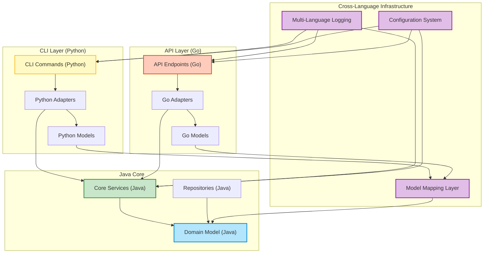

# Rinna Clean Architecture Diagram

This document provides a detailed diagram of Rinna's Clean Architecture implementation, showing the layers, components, and dependencies.

## Clean Architecture Layer Diagram

```mermaid
flowchart TD
    %% Define the main layers
    subgraph "Domain Layer (Entities)"
        domain["Domain Entities"]
        style domain fill:#e1f5fe,stroke:#01579b,stroke-width:2px
        
        subgraph "Core Domain Models"
            WorkItem["WorkItem"]
            WorkQueue["WorkQueue"]
            Project["Project"]
            Release["Release"]
            WorkflowState["WorkflowState"]
            Priority["Priority"]
            WorkItemType["WorkItemType"]
        end
    end
    
    subgraph "Use Case Layer"
        usecase["Use Cases / Application Services"]
        style usecase fill:#e8f5e9,stroke:#2e7d32,stroke-width:2px
        
        subgraph "Service Interfaces"
            ItemService["ItemService"]
            WorkflowService["WorkflowService"]
            QueueService["QueueService"]
            ReleaseService["ReleaseService"]
            SearchService["SearchService"]
            CriticalPathService["CriticalPathService"]
            DocumentService["DocumentService"]
            CommentService["CommentService"]
            HistoryService["HistoryService"]
        end
    end
    
    subgraph "Interface Adapters Layer"
        adapters["Interface Adapters"]
        style adapters fill:#fff3e0,stroke:#e65100,stroke-width:2px
        
        subgraph "Input Adapters"
            Controllers["Controllers"]
            Presenters["Presenters"]
            CLICommands["CLI Commands"]
            APIEndpoints["API Endpoints"]
        end
        
        subgraph "Output Adapters"
            Repositories["Repositories"]
            Gateways["Gateways"]
            ExternalServices["External Services"]
        end
    end
    
    subgraph "Frameworks & Drivers Layer"
        infra["Frameworks & Drivers"]
        style infra fill:#e8eaf6,stroke:#3f51b5,stroke-width:2px
        
        subgraph "UI Frameworks"
            CLI["CLI (Python)"]
            WebUI["Web UI (Spring)"]
        end
        
        subgraph "External Systems"
            Database["Database (SQLite)"]
            RESTServices["REST Services (Go)"]
            DocumentGen["Document Generator"]
        end
        
        subgraph "Cross-cutting"
            Logging["Logging System"]
            Config["Configuration"]
            Security["Security"]
        end
    end
    
    %% Define dependencies (always pointing inward)
    
    %% Use cases depend on Domain
    usecase --> domain
    
    %% Interface Adapters depend on Use Cases and Domain
    adapters --> usecase
    adapters --> domain
    
    %% Frameworks depend on Interface Adapters
    infra --> adapters
    
    %% Specific Dependencies
    CLICommands --> ItemService
    CLICommands --> WorkflowService
    CLICommands --> SearchService
    
    Controllers --> ItemService
    Controllers --> WorkflowService
    Controllers --> ReleaseService
    
    Repositories --> WorkItem
    Repositories --> WorkQueue
    Repositories --> Project
    
    CLI --> CLICommands
    WebUI --> Controllers
    RESTServices --> APIEndpoints
    Database --> Repositories
    
    %% Style for components
    style WorkItem fill:#bbdefb,stroke:#1976d2
    style ItemService fill:#c8e6c9,stroke:#388e3c
    style WorkflowService fill:#c8e6c9,stroke:#388e3c
    style Repositories fill:#ffcc80,stroke:#f57c00
    style CLICommands fill:#ffcc80,stroke:#f57c00
    style Controllers fill:#ffcc80,stroke:#f57c00
```



## Component Dependencies Diagram

```mermaid
classDiagram
    %% Domain Layer
    class WorkItem {
        +id: UUID
        +title: String
        +description: String
        +status: WorkflowState
        +priority: Priority
        +type: WorkItemType
        +assignee: String
    }
    
    class WorkflowState {
        <<enumeration>>
        FOUND
        TRIAGED
        TO_DO
        IN_PROGRESS
        IN_TEST
        DONE
        RELEASED
    }
    
    class Priority {
        <<enumeration>>
        LOW
        MEDIUM
        HIGH
        CRITICAL
    }
    
    class WorkItemType {
        <<enumeration>>
        GOAL
        FEATURE
        BUG
        CHORE
    }
    
    %% Use Case Layer
    class ItemService {
        <<interface>>
        +getItem(id: UUID): WorkItem
        +createWorkItem(item: WorkItem): WorkItem
        +updateWorkItem(item: WorkItem): WorkItem
        +deleteWorkItem(id: UUID): boolean
        +getWorkItemsByProject(projectId: UUID): List~WorkItem~
    }
    
    class WorkflowService {
        <<interface>>
        +transition(itemId: UUID, targetState: WorkflowState): WorkItem
        +canTransition(itemId: UUID, targetState: WorkflowState): boolean
        +getAvailableTransitions(itemId: UUID): List~WorkflowState~
        +getCurrentWorkInProgress(user: String): WorkItem
    }
    
    class SearchService {
        <<interface>>
        +findWorkItems(criteria: Map, limit: int): List~WorkItem~
        +findByStatus(status: WorkflowState): List~WorkItem~
        +findByAssignee(assignee: String): List~WorkItem~
        +search(query: String): List~WorkItem~
    }
    
    class CriticalPathService {
        <<interface>>
        +addDependency(dependentId: UUID, dependencyId: UUID): boolean
        +removeDependency(dependentId: UUID, dependencyId: UUID): boolean
        +calculateCriticalPath(): List~WorkItem~
        +identifyBlockers(): List~WorkItem~
    }
    
    %% Interface Adapters Layer
    class DefaultItemService {
        -itemRepository: ItemRepository
        +getItem(id: UUID): WorkItem
        +createWorkItem(item: WorkItem): WorkItem
        +updateWorkItem(item: WorkItem): WorkItem
        +deleteWorkItem(id: UUID): boolean
    }
    
    class DefaultWorkflowService {
        -itemRepository: ItemRepository
        +transition(itemId: UUID, targetState: WorkflowState): WorkItem
        +canTransition(itemId: UUID, targetState: WorkflowState): boolean
        +getAvailableTransitions(itemId: UUID): List~WorkflowState~
    }
    
    class DefaultSearchService {
        -itemRepository: ItemRepository
        +findWorkItems(criteria: Map, limit: int): List~WorkItem~
        +findByStatus(status: WorkflowState): List~WorkItem~
        +search(query: String): List~WorkItem~
    }
    
    class ItemRepository {
        <<interface>>
        +findById(id: UUID): Optional~WorkItem~
        +save(item: WorkItem): WorkItem
        +delete(id: UUID): boolean
        +findAll(): List~WorkItem~
        +findByStatus(status: WorkflowState): List~WorkItem~
    }
    
    class AddCommand {
        -itemService: ItemService
        -workflowService: WorkflowService
        +call(): Integer
    }
    
    class ListCommand {
        -searchService: SearchService
        +call(): Integer
    }
    
    class ViewCommand {
        -itemService: ItemService
        +call(): Integer
    }
    
    %% Frameworks Layer
    class InMemoryItemRepository {
        -items: Map~UUID, WorkItem~
        +findById(id: UUID): Optional~WorkItem~
        +save(item: WorkItem): WorkItem
        +delete(id: UUID): boolean
    }
    
    class SQLiteItemRepository {
        -connectionManager: SQLiteConnectionManager
        +findById(id: UUID): Optional~WorkItem~
        +save(item: WorkItem): WorkItem
        +delete(id: UUID): boolean
    }
    
    class RinnaCLI {
        +main(args: String[]): void
        +parseCommands(): void
    }
    
    %% Relationships
    DefaultItemService ..|> ItemService
    DefaultWorkflowService ..|> WorkflowService
    DefaultSearchService ..|> SearchService
    
    InMemoryItemRepository ..|> ItemRepository
    SQLiteItemRepository ..|> ItemRepository
    
    DefaultItemService --> ItemRepository
    DefaultWorkflowService --> ItemRepository
    DefaultSearchService --> ItemRepository
    
    AddCommand --> ItemService
    AddCommand --> WorkflowService
    ListCommand --> SearchService
    ViewCommand --> ItemService
    
    RinnaCLI --> AddCommand
    RinnaCLI --> ListCommand
    RinnaCLI --> ViewCommand
    
    WorkItem --> WorkflowState
    WorkItem --> Priority
    WorkItem --> WorkItemType
```



## Cross-Language Integration Diagram



## Directory Structure Mapping

This diagram shows how the Clean Architecture layers are reflected in the project's directory structure:

```
rinna/
├── rinna-core/                   # Domain + Use Cases
│   └── src/main/java/org/rinna/
│       ├── domain/               # Domain Layer
│       │   ├── model/            # Core domain entities
│       │   ├── repository/       # Repository interfaces
│       │   └── service/          # Service interfaces
│       └── usecase/              # Use Case Layer implementations
│
├── rinna-cli/                    # CLI Interface Adapters
│   └── src/main/java/org/rinna/cli/
│       ├── command/              # CLI commands (Interface Adapters)
│       ├── adapter/              # Service adapters
│       ├── model/                # CLI-specific models
│       └── service/              # Service implementations
│
├── version-service/              # Version Infrastructure
│   ├── core/                     # Version core model
│   └── adapters/                 # Version adapters for different languages
│       ├── java/
│       ├── python/
│       ├── go/
│       └── bash/
│
├── api/                          # Go API Layer
│   ├── cmd/                      # Entry points (framework layer)
│   ├── internal/                 # Internal implementations
│   │   ├── handlers/             # API handlers (interface adapters)
│   │   ├── models/               # API models
│   │   └── middleware/           # API middleware
│   └── pkg/                      # Reusable packages
│
└── python/                       # Python components
    └── rinna/                    # Python package
        ├── cli/                  # CLI components
        └── logging/              # Logging infrastructure
```

## Clean Architecture Concepts in Rinna

### Dependency Rule

The fundamental rule of Clean Architecture is that dependencies point inward. In Rinna:

1. **Domain Layer** has no dependencies on other layers
2. **Use Case Layer** depends only on Domain Layer
3. **Interface Adapters Layer** depends on Use Case and Domain Layers
4. **Frameworks & Drivers Layer** depends on Interface Adapters Layer

### Cross-Cutting Concerns

Some concerns span across all layers:

1. **Logging**: Implemented in each layer but with dependencies pointing inward
2. **Configuration**: Domain-specific configuration defined in inner layers, technical configuration in outer layers
3. **Security**: Domain security rules in inner layers, implementation in outer layers

### Polyglot Implementation

Rinna's Clean Architecture is implemented across multiple languages:

1. **Java**: Core domain and business logic
2. **Go**: API and external interfaces
3. **Python**: CLI and scripting components
4. **Bash**: Build and utility scripts

This is achieved through:
- Clear interface boundaries between layers
- Consistent data mapping between language-specific models
- Unified logging and configuration systems