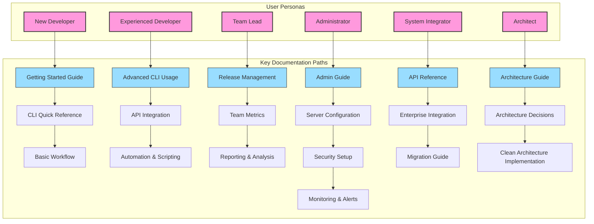
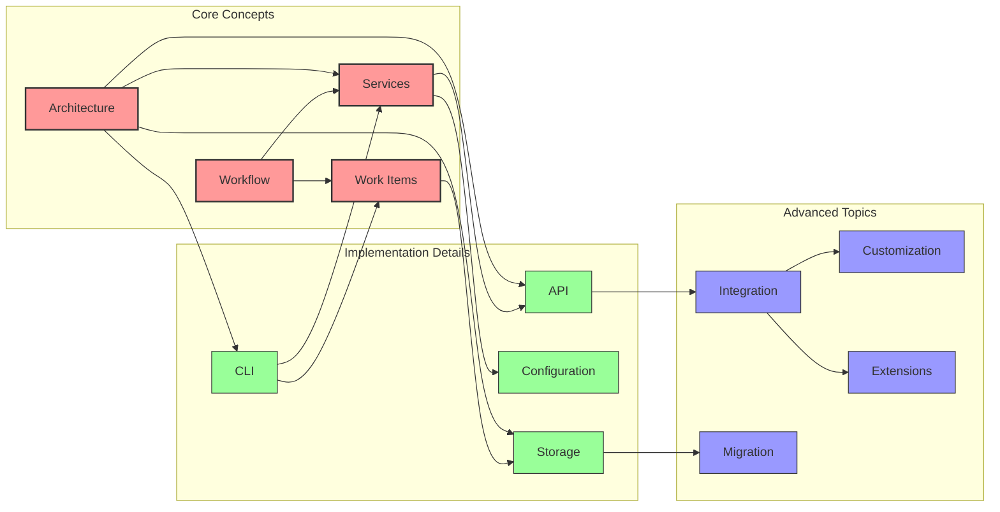

# Rinna Documentation Structure

This diagram provides a visual map of Rinna's documentation structure and relationships between key documents.

## Documentation Map

```mermaid
graph TB
    subgraph "Entry Points"
        Root["docs/README.md"]
        GettingStarted["Getting Started"]
        UserGuide["User Guide"]
        DeveloperGuide["Development Guide"]
        AdminGuide["Admin Guide"]
    end
    
    Root --> GettingStarted
    Root --> UserGuide
    Root --> DeveloperGuide
    Root --> AdminGuide
    
    subgraph "Getting Started"
        QuickStart["Quick Start Guide"]
        Installation["Installation"]
        FirstSteps["First Steps"]
    end
    
    GettingStarted --> QuickStart
    GettingStarted --> Installation
    GettingStarted --> FirstSteps
    
    subgraph "User Guide"
        UGCLI["CLI Tool Reference"]
        Workflow["Workflow"]
        WorkflowPhil["Workflow Philosophy"]
        WorkItems["Work Item Management"]
        ReleaseMgmt["Release Management"]
        DocGen["Document Generation"]
        Services["Service Management"]
        Config["Configuration"]
        Lota["Lota (Dev Cycle)"]
        
        subgraph "Integration"
            ApiIntegration["API Integration"]
            EntIntegration["Enterprise Integration"]
            Migration["Migration Guide"]
        end
    end
    
    UserGuide --> UGCLI
    UserGuide --> Workflow
    UserGuide --> WorkflowPhil
    UserGuide --> WorkItems
    UserGuide --> ReleaseMgmt
    UserGuide --> DocGen
    UserGuide --> Services
    UserGuide --> Config
    UserGuide --> Lota
    UserGuide --> ApiIntegration
    ApiIntegration --> EntIntegration
    UserGuide --> Migration
    
    subgraph "Admin Guide"
        AdminCLI["Admin CLI Quick Start"]
        ServerSetup["Server Setup"]
        AdminConfig["System Configuration"]
        UserMgmt["User Management"]
        ProjMgmt["Project Management"]
        IntegrationConfig["Integration Configuration"]
        Backup["Backup & Recovery"]
        Monitoring["System Monitoring"]
        Security["Security Configuration"]
    end
    
    AdminGuide --> AdminCLI
    AdminGuide --> ServerSetup
    AdminGuide --> AdminConfig
    AdminGuide --> UserMgmt
    AdminGuide --> ProjMgmt
    AdminGuide --> IntegrationConfig
    AdminGuide --> Backup
    AdminGuide --> Monitoring
    AdminGuide --> Security
    
    subgraph "Development Guide"
        Architecture["Architecture"]
        DesignApproach["Design Approach"]
        PackageStructure["Package Structure"]
        Testing["Testing Strategy"]
        Java21["Java 21 Features"]
        BuildSystem["Build System"]
        Contributing["Contributing"]
        Logging["Logging Strategy"]
        VersionMgmt["Version Management"]
    end
    
    DeveloperGuide --> Architecture
    DeveloperGuide --> DesignApproach
    DeveloperGuide --> PackageStructure
    DeveloperGuide --> Testing
    DeveloperGuide --> Java21
    DeveloperGuide --> BuildSystem
    DeveloperGuide --> Contributing
    DeveloperGuide --> Logging
    DeveloperGuide --> VersionMgmt
    
    subgraph "Visual Documentation"
        WorkflowDiagram["Workflow Diagram"]
        CleanArchDiagram["Clean Architecture Diagram"]
        EntIntDiagram["Enterprise Integration Diagram"]
        DocStructure["Documentation Structure"]
    end
    
    Root --> DocStructure
    Workflow --> WorkflowDiagram
    Architecture --> CleanArchDiagram
    EntIntegration --> EntIntDiagram
    
    subgraph "Specifications"
        TechSpec["Technical Specification"]
        EngSpec["Engineering Specification"]
        ADRs["Architecture Decisions"]
    end
    
    Root --> TechSpec
    TechSpec --> EngSpec
    Architecture --> ADRs
    
    classDef primary fill:#f9f,stroke:#333,stroke-width:2px;
    classDef secondary fill:#ccf,stroke:#333,stroke-width:1px;
    classDef tertiary fill:#ffc,stroke:#333,stroke-width:1px;
    classDef visual fill:#cfc,stroke:#333,stroke-width:1px;
    
    class Root,GettingStarted,UserGuide,DeveloperGuide,AdminGuide primary;
    class UGCLI,Workflow,Architecture,AdminCLI,QuickStart secondary;
    class WorkItems,ReleaseMgmt,Testing,DesignApproach,ServerSetup tertiary;
    class WorkflowDiagram,CleanArchDiagram,EntIntDiagram,DocStructure visual;
```

## Documentation by User Persona

## Document Relationships and Dependencies

