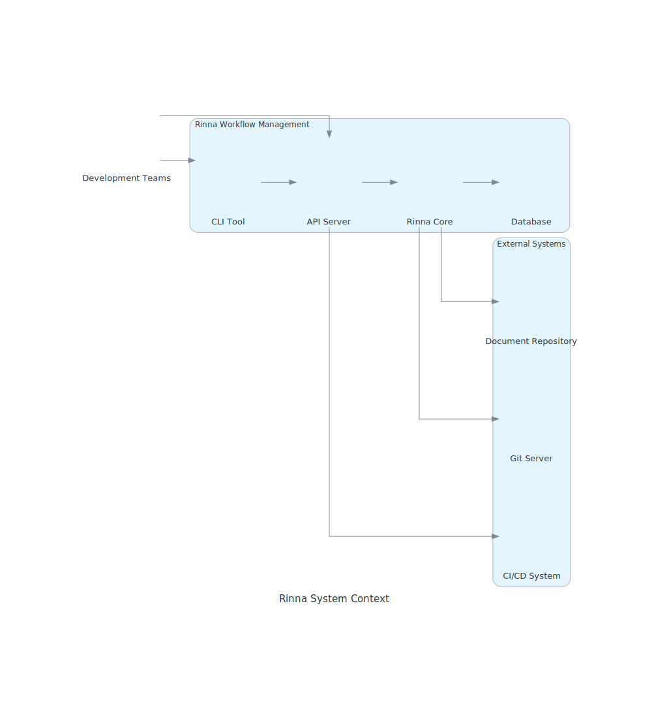
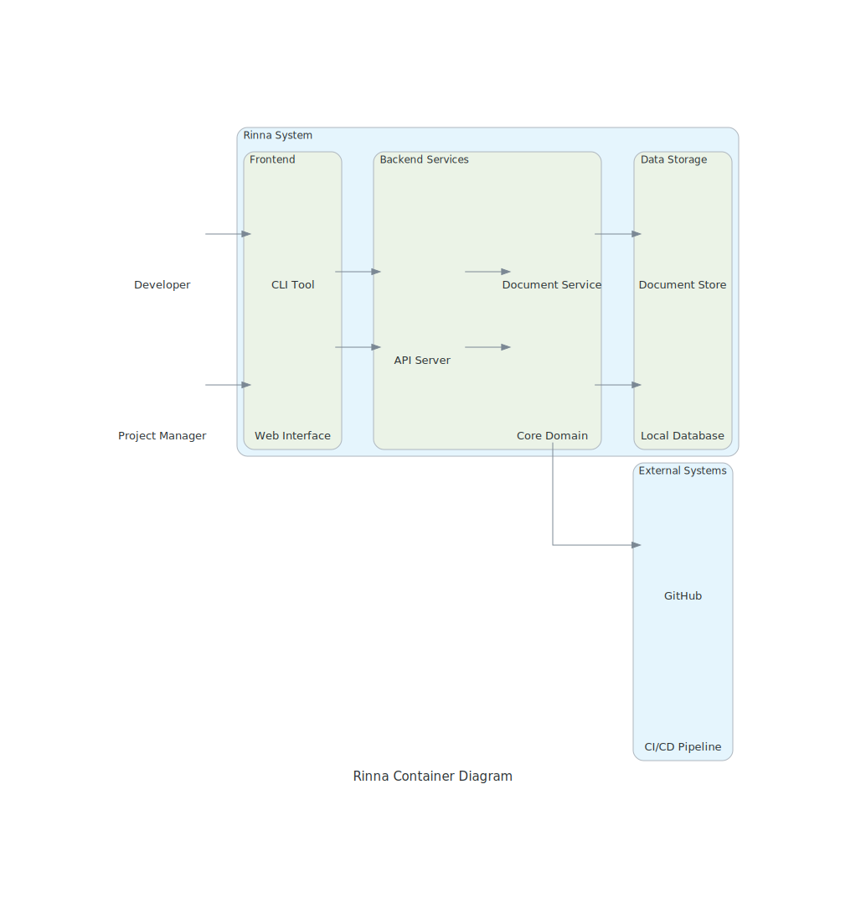
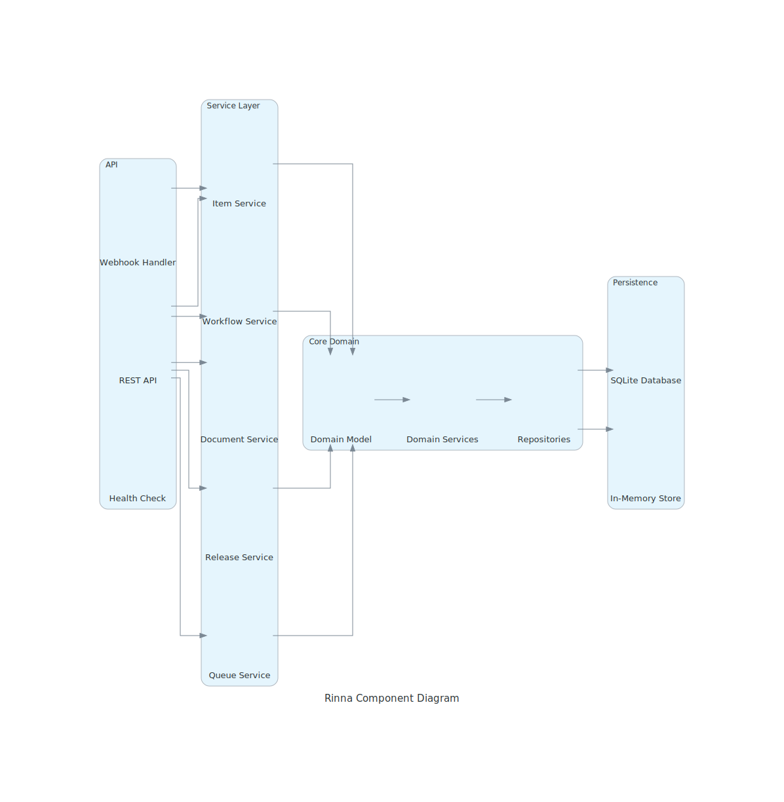
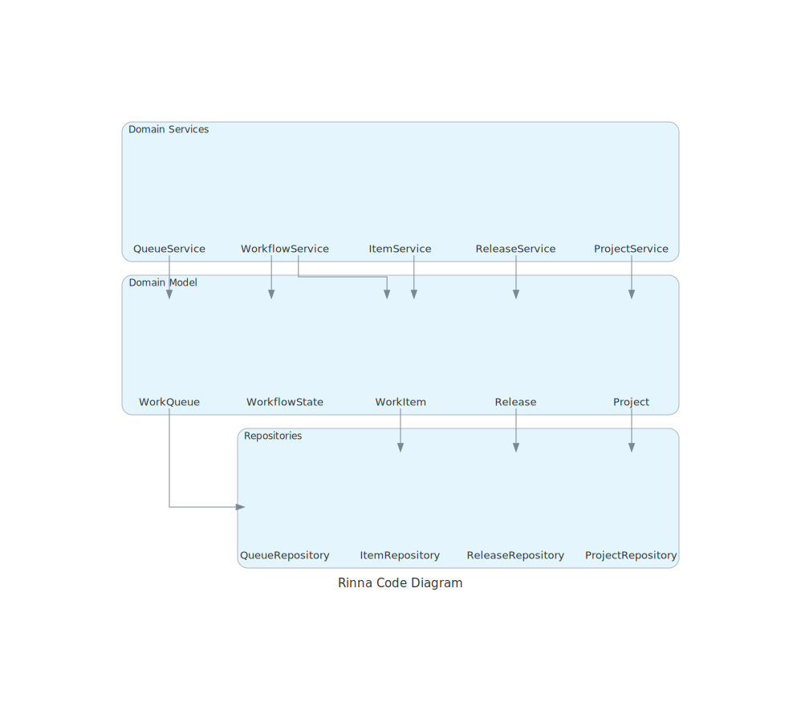

# Rinna C4 Architecture Diagrams

Last generated: Mon Apr  7 21:54:28 EDT 2025

This directory contains automatically generated C4 model diagrams for the Rinna project.

## Context Diagram

The context diagram shows the high-level system context and external dependencies:



## Container Diagram

The container diagram shows the major components and their relationships:



## Component Diagram

The component diagram shows the internal components of the system:



## Code Diagram

The code diagram shows the key classes and their relationships:



## Diagram Generation

These diagrams are automatically generated during the build process. To manually regenerate them, run:

```
./bin/generate-diagrams.sh
```

For more options, run:

```
./bin/generate-diagrams.sh --help
```
