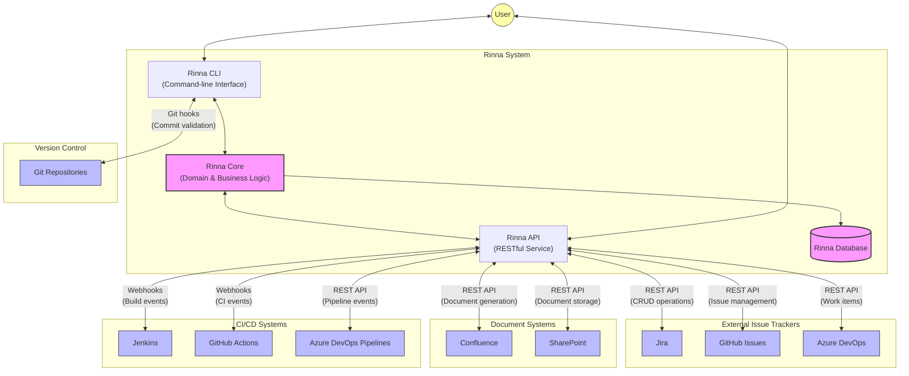
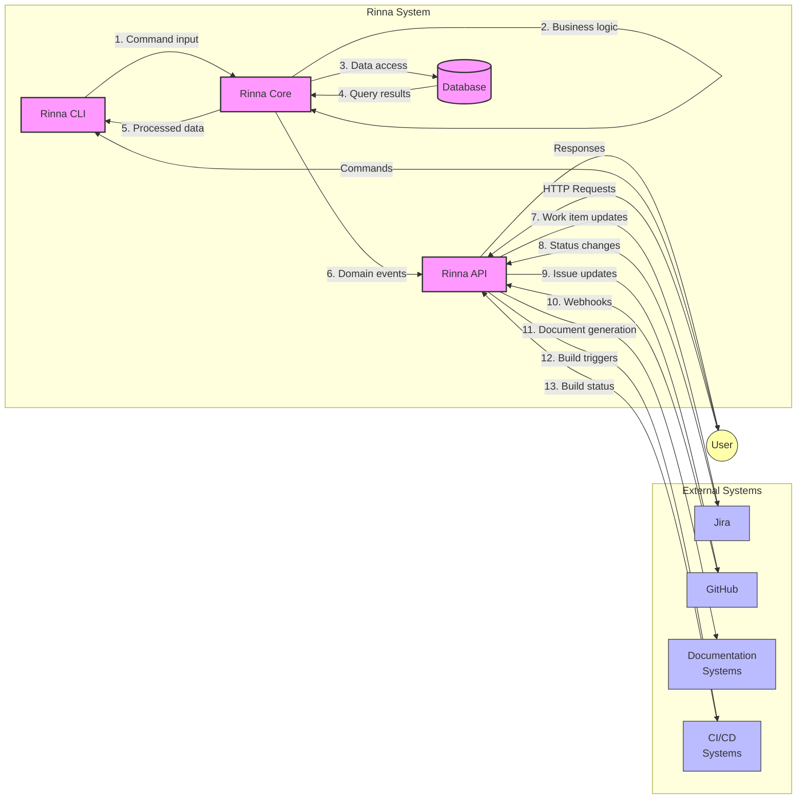
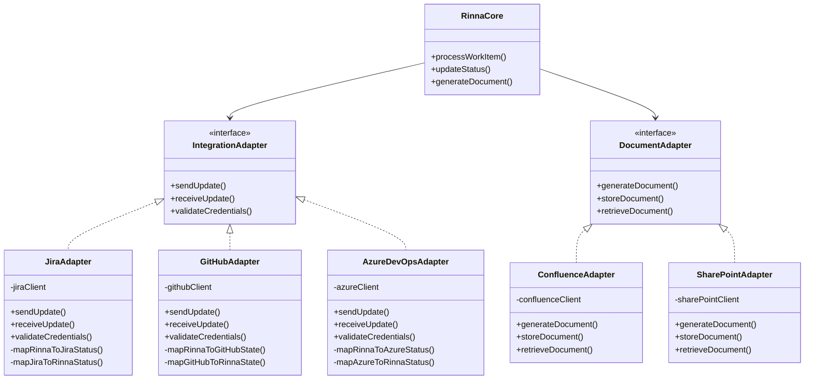
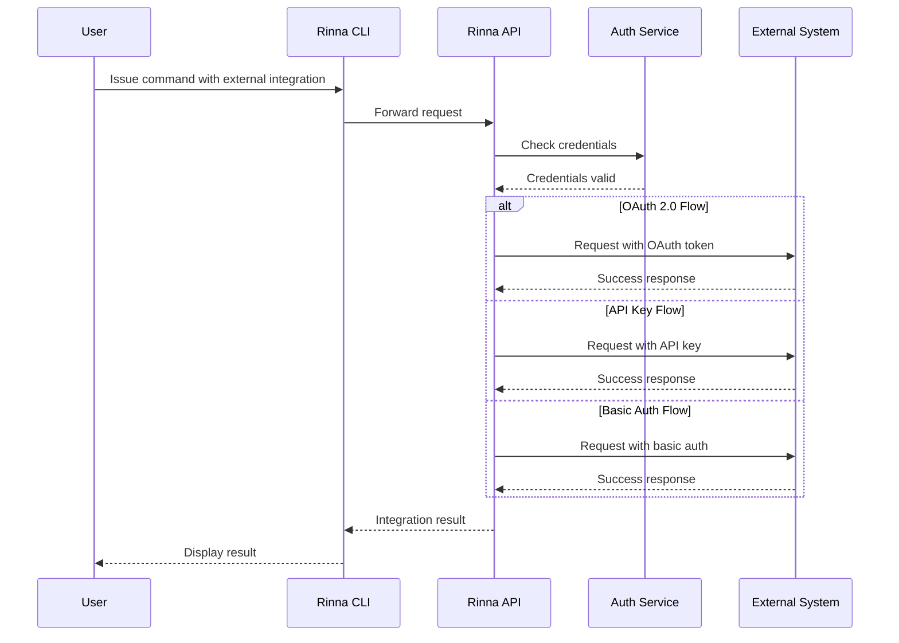

# Rinna Enterprise Integration

This diagram shows how Rinna integrates with external systems and the data flow between components.

## System Integration Diagram

## Data Flow Diagram

## Integration Adapters

## Security and Authentication Flow

## Integration Configuration

The integration between Rinna and external systems relies on a flexible adapter pattern with configuration-driven connections. Each integration point requires specific configuration in the `config/integrations` directory:

1. **Authentication Configuration**: Credentials, tokens, and connection settings
2. **Field Mapping Configuration**: Mapping between Rinna fields and external system fields
3. **Workflow State Mapping**: Translation between Rinna workflow states and external system states
4. **Webhook Configuration**: Endpoints and event triggers for bidirectional updates
5. **Document Templates**: Templates for generating documents in external systems

## Implementation Strategy

The integration system follows these key principles:

1. **Loose Coupling**: Rinna core functionality works independently of external integrations
2. **Adapter Pattern**: Each external system has a dedicated adapter implementing common interfaces
3. **Idempotent Operations**: Integration operations can be safely retried without side effects
4. **Fallback Mechanisms**: System continues functioning when external systems are unavailable
5. **Audit Trail**: All integration actions are logged with comprehensive tracking