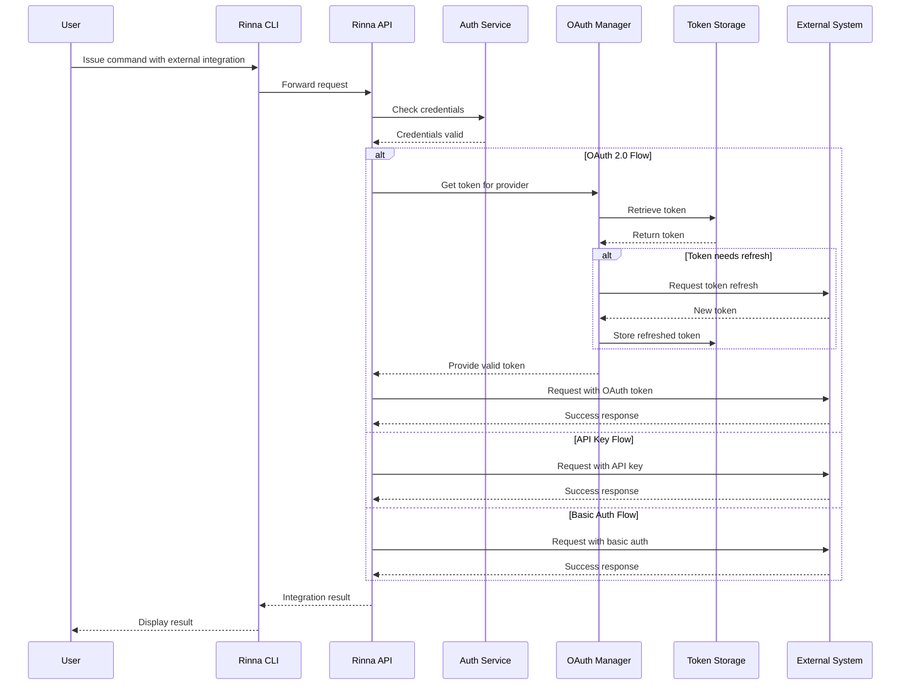
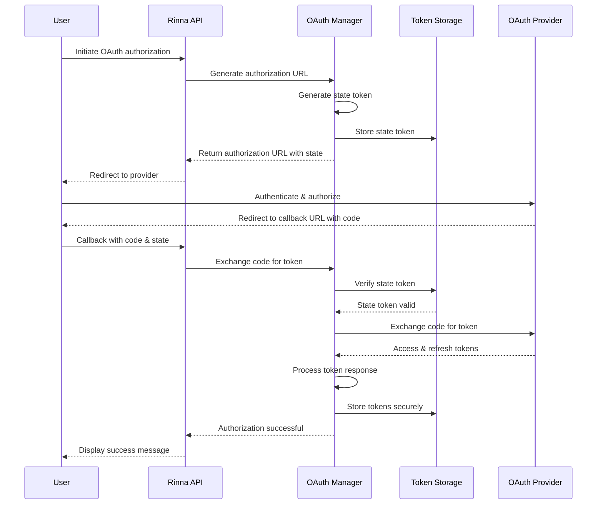

# Rinna Enterprise Integration

This diagram shows how Rinna integrates with external systems and the data flow between components.

## System Integration Diagram


## Data Flow Diagram


## Integration Adapters


## Security and Authentication Flow



## OAuth Authorization Flow



## Integration Configuration

The integration between Rinna and external systems relies on a flexible adapter pattern with configuration-driven connections. Each integration point requires specific configuration in the `config/integrations` directory:

1. **Authentication Configuration**: Credentials, tokens, and connection settings
   - **OAuth Configuration**: Client IDs, secrets, redirect URLs, and scopes for OAuth providers
   - **API Key Configuration**: API keys and secrets for services using key-based authentication
   - **Basic Auth Configuration**: Username and password credentials for basic authentication

2. **OAuth Provider Configuration**: Settings for supported OAuth providers:
   - GitHub: OAuth application credentials and API endpoints
   - GitLab: OAuth application credentials and API endpoints
   - Jira: OAuth application credentials and API endpoints
   - Azure DevOps: OAuth application credentials and API endpoints
   - Bitbucket: OAuth application credentials and API endpoints

3. **Field Mapping Configuration**: Mapping between Rinna fields and external system fields
4. **Workflow State Mapping**: Translation between Rinna workflow states and external system states
5. **Webhook Configuration**: Endpoints and event triggers for bidirectional updates
6. **Document Templates**: Templates for generating documents in external systems

### OAuth Configuration Example

```yaml
oauth:
  # Encryption key for token storage (in production, use a secure random key)
  token_encryption_key: "your-secure-encryption-key"
  
  # GitHub OAuth configuration
  github:
    enabled: true
    client_id: "github-client-id"
    client_secret: "github-client-secret"
    redirect_url: "http://localhost:8080/api/v1/oauth/callback"
    scopes:
      - "repo"
      - "user:email"
  
  # GitLab OAuth configuration
  gitlab:
    enabled: true
    client_id: "gitlab-client-id"
    client_secret: "gitlab-client-secret"
    redirect_url: "http://localhost:8080/api/v1/oauth/callback"
    server_url: "https://gitlab.com"  # Or custom GitLab instance
    scopes:
      - "api"
      - "read_user"
```

## Implementation Strategy

The integration system follows these key principles:

1. **Loose Coupling**: Rinna core functionality works independently of external integrations
2. **Adapter Pattern**: Each external system has a dedicated adapter implementing common interfaces
3. **Idempotent Operations**: Integration operations can be safely retried without side effects
4. **Fallback Mechanisms**: System continues functioning when external systems are unavailable
5. **Audit Trail**: All integration actions are logged with comprehensive tracking
6. **Secure Authentication**: OAuth 2.0 for third-party API access with token encryption and refresh capabilities
7. **Provider Flexibility**: Unified API across different OAuth providers to simplify integration
8. **Stateless Design**: Authorization state managed securely with CSRF protection

### OAuth Implementation Features

- **Centralized Token Management**: All OAuth tokens are managed by the OAuth Manager component
- **Secure Token Storage**: Tokens are encrypted at rest using AES-GCM
- **Token Refresh**: Automatic refresh of expired tokens when possible
- **Provider Abstraction**: Common interface for all OAuth providers
- **State Parameter Protection**: Prevention of CSRF attacks during authorization
- **Scoped Access**: Tokens are scoped to specific projects and users
- **Revocation Support**: Ability to revoke tokens when access is no longer needed