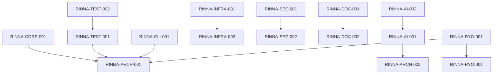

# Rinna Development Work Items

This document contains a consolidated, non-redundant set of classified work items for Rinna development, organized according to Ryorin-Do principles and mapped to Rinna's internal workflow.

## Work Item Categories

Items are classified using the following schema:

- **Type**: Feature, Bug, Chore, Architecture, Documentation
- **Status**: Backlog, To_Do, In_Progress, In_Test, Done, Released, Blocked
- **Priority**: Critical, High, Medium, Low
- **CYNEFIN Domain**: Clear, Complicated, Complex, Chaotic
- **Work Paradigm**: Task, Story, Epic, Initiative
- **Cognitive Load**: 1-10 scale (10 being highest)

## Work Items

### Core Functionality

#### 1. Parallel Execution Capabilities

- **ID**: RINNA-CORE-001
- **Type**: Feature
- **Status**: Released
- **Priority**: High
- **CYNEFIN Domain**: Complicated
- **Work Paradigm**: Story
- **Cognitive Load**: 7
- **Version**: 1.8.3
- **Description**: Implementation of parallel execution capabilities in the build system to improve build performance and reduce compilation time.
- **Sub-tasks**:
  - Add `--parallel` flag to enable parallel builds
  - Optimize command output capturing
  - Enhance build script for parallel component compilation
  - Implement thread-per-core parallelism for Maven builds
  - Add parallel test execution for Go and Python

#### 2. Clean Architecture Implementation

- **ID**: RINNA-ARCH-001
- **Type**: Architecture
- **Status**: In_Progress
- **Priority**: Critical
- **CYNEFIN Domain**: Complex
- **Work Paradigm**: Epic
- **Cognitive Load**: 9
- **Description**: Refactor Rinna's architecture to align with clean architecture principles, isolating core domain logic from external dependencies.
- **Sub-tasks**:
  - Implement clear interfaces between architecture layers
  - Ensure separation of concerns across all components
  - Create architectural documentation showing compliance
  - Update container and component diagrams
  - Implement version consistency checking

#### 3. Test Pyramid Strategy

- **ID**: RINNA-TEST-001
- **Type**: Feature
- **Status**: Released
- **Priority**: High
- **CYNEFIN Domain**: Complicated
- **Work Paradigm**: Story
- **Cognitive Load**: 8
- **Version**: 1.3.14
- **Description**: Implementation of a comprehensive test pyramid strategy following Uncle Bob and Martin Fowler principles with five distinct test categories.
- **Sub-tasks**:
  - Implement JUnit 5 Tag-based test categorization system
  - Create Maven profiles for selective test execution
  - Enhance CI workflow with stage-appropriate test execution
  - Develop detailed testing strategy documentation
  - Create tagged test examples for each category

### AI Integration

#### 4. AI-Enhanced Smart Field Population

- **ID**: RINNA-AI-001
- **Type**: Feature
- **Status**: Released
- **Priority**: Medium
- **CYNEFIN Domain**: Complex
- **Work Paradigm**: Story
- **Cognitive Load**: 8
- **Version**: 1.8.1
- **Description**: Intelligent prediction of field values with personalized user pattern recognition using privacy-preserving local AI service.
- **Sub-tasks**:
  - Implement memory monitoring with adaptive model selection
  - Create user feedback loop for continuous improvement
  - Develop field prioritization based on usage and importance
  - Build multi-model prediction system for higher quality results
  - Implement context-aware suggestion system with evidence tracking

#### 5. Work Complexity Assessment

- **ID**: RINNA-AI-002
- **Type**: Feature
- **Status**: Backlog
- **Priority**: Medium
- **CYNEFIN Domain**: Complex
- **Work Paradigm**: Task
- **Cognitive Load**: 7
- **Description**: Implementation of AI-based work complexity assessment for automatic categorization of work items by domain.
- **Sub-tasks**:
  - Develop ML models for complexity prediction
  - Create training dataset from existing work items
  - Implement feature extraction from work item descriptions
  - Build integration with the work item creation process
  - Create feedback loop for improving predictions

### Architecture and Infrastructure

#### 6. Extension Architecture

- **ID**: RINNA-ARCH-002
- **Type**: Architecture
- **Status**: Released
- **Priority**: High
- **CYNEFIN Domain**: Complicated
- **Work Paradigm**: Epic
- **Cognitive Load**: 9
- **Version**: 1.11.0
- **Description**: Creation of an extension architecture for commercial feature integration with base extension interface and specialized extension types.
- **Sub-tasks**:
  - Implement extension registry with ServiceLoader discovery
  - Create templates for commercial extension development
  - Build sample implementations of template and AI service extensions
  - Ensure clean separation between open source and commercial code
  - Document extension interface specifications

#### 7. Cross-Platform Container Enhancements

- **ID**: RINNA-INFRA-001
- **Type**: Feature
- **Status**: Released
- **Priority**: High
- **CYNEFIN Domain**: Complicated
- **Work Paradigm**: Story
- **Cognitive Load**: 8
- **Version**: 1.10.8
- **Description**: Universal container support for all environments with zero-install option and advanced health monitoring.
- **Sub-tasks**:
  - Implement platform-specific optimizations for various environments
  - Add SELinux integration with proper volume labeling
  - Support Podman rootless mode with enhanced security
  - Create performance metrics collection and visualization
  - Implement detailed resource usage monitoring

### Security and Integration

#### 8. API Rate Limiting and Security

- **ID**: RINNA-SEC-001
- **Type**: Feature
- **Status**: Released
- **Priority**: High
- **CYNEFIN Domain**: Clear
- **Work Paradigm**: Story
- **Cognitive Load**: 6
- **Version**: 1.10.4
- **Description**: Implementation of API rate limiting with customizable thresholds and advanced security logging.
- **Sub-tasks**:
  - Create per-endpoint rate limiting configuration
  - Implement IP-based rate limiting with whitelist support
  - Develop comprehensive request body and parameter redaction
  - Add request tracing with unique identifiers
  - Implement security context for all requests

#### 9. OAuth 2.0 Integration

- **ID**: RINNA-SEC-002
- **Type**: Feature
- **Status**: Released
- **Priority**: High
- **CYNEFIN Domain**: Complicated
- **Work Paradigm**: Story
- **Cognitive Load**: 7
- **Version**: 1.10.1
- **Description**: Integration with OAuth 2.0 for secure third-party service authentication including GitHub, GitLab, Jira, Azure DevOps, and Bitbucket.
- **Sub-tasks**:
  - Implement secure token storage with AES-GCM encryption
  - Add automatic token refresh capability
  - Create OAuth configuration system with provider-specific settings
  - Develop REST API endpoints for OAuth management
  - Create comprehensive integration documentation

### Flexibility and Management

#### 10. Feature Flag Control System

- **ID**: RINNA-FLEX-001
- **Type**: Feature
- **Status**: Released
- **Priority**: Medium
- **CYNEFIN Domain**: Clear
- **Work Paradigm**: Story
- **Cognitive Load**: 6
- **Version**: 1.10.7
- **Description**: Runtime control system for enabling/disabling features with persistent storage and hierarchical relationships.
- **Sub-tasks**:
  - Implement persistent storage with JSON serialization
  - Create hierarchical flag relationships with dependencies
  - Integrate with notification system components
  - Add admin CLI commands for flag management
  - Create comprehensive documentation

#### 11. Multi-Language Logging System

- **ID**: RINNA-INFRA-002
- **Type**: Feature
- **Status**: Released
- **Priority**: Medium
- **CYNEFIN Domain**: Complicated
- **Work Paradigm**: Story
- **Cognitive Load**: 7
- **Version**: 1.9.0
- **Description**: Implementation of a unified logging system supporting Java, Python, Bash, and Go with consistent formatting.
- **Sub-tasks**:
  - Create context field support for structured logging
  - Implement language-specific logging bridges
  - Add TRACE level support for Python
  - Create cross-language logging tests
  - Write comprehensive logging documentation

### Documentation and Organization

#### 12. Documentation Restructuring

- **ID**: RINNA-DOC-001
- **Type**: Documentation
- **Status**: Released
- **Priority**: Medium
- **CYNEFIN Domain**: Clear
- **Work Paradigm**: Story
- **Cognitive Load**: 4
- **Version**: 1.8.2
- **Description**: Consolidation and restructuring of implementation documentation into structured directories with improved organization.
- **Sub-tasks**:
  - Create centralized index files for implementation summaries
  - Improve documentation organization and navigation
  - Add documentation for script organization strategy
  - Reorganize implementation plans with consistent structure
  - Update project status documentation

#### 13. Root Directory Cleanup

- **ID**: RINNA-DOC-002
- **Type**: Chore
- **Status**: Done
- **Priority**: Low
- **CYNEFIN Domain**: Clear
- **Work Paradigm**: Task
- **Cognitive Load**: 3
- **Description**: Cleanup of the Rinna project root directory to improve organization by making README.md the only markdown file in root.
- **Sub-tasks**:
  - Move markdown files to appropriate subdirectories
  - Relocate shell scripts to utils directory
  - Create symbolic links for backward compatibility
  - Organize configuration files into proper directories
  - Update README.md to reflect new structure

### Ryorin-Do Integration

#### 14. RDSITWM1.2 Compliance - Core Data Model

- **ID**: RINNA-RYO-001
- **Type**: Feature
- **Status**: To_Do
- **Priority**: High
- **CYNEFIN Domain**: Complex
- **Work Paradigm**: Epic
- **Cognitive Load**: 9
- **Description**: Extension of work item schema to support RDSITWM1.2 CSV format with CYNEFIN domain classification and cognitive load assessment.
- **Sub-tasks**:
  - Add CYNEFIN domain classification to work items
  - Implement cognitive load assessment framework
  - Add outcome-oriented fields and tracking
  - Integrate multi-paradigm work management support
  - Create domain assessment tool for work items

#### 15. RDSITWM1.2 Compliance - Advanced Analytics

- **ID**: RINNA-RYO-002
- **Type**: Feature
- **Status**: To_Do
- **Priority**: Medium
- **CYNEFIN Domain**: Complicated
- **Work Paradigm**: Story
- **Cognitive Load**: 7
- **Description**: Implementation of CYNEFIN domain distribution analytics and cognitive load dashboards with outcome achievement measurement.
- **Sub-tasks**:
  - Create cognitive load dashboards and reports
  - Develop outcome achievement measurement system
  - Build paradigm alignment reporting
  - Implement sociotechnical balance metrics
  - Create visualization for domain distribution

### Quality and Testing

#### 16. Unified Code Coverage Reporting

- **ID**: RINNA-TEST-002
- **Type**: Feature
- **Status**: Released
- **Priority**: Medium
- **CYNEFIN Domain**: Clear
- **Work Paradigm**: Story
- **Cognitive Load**: 5
- **Version**: 1.10.5
- **Description**: Implementation of a unified code coverage reporting system for all languages with comprehensive CI pipeline.
- **Sub-tasks**:
  - Add multi-language test coverage badges
  - Implement coverage trend reporting and history tracking
  - Add PR status comments with detailed coverage info
  - Integrate with SonarQube for code quality metrics
  - Create enhanced architecture validation workflow

#### 17. CLI Operation Tracking

- **ID**: RINNA-CLI-001
- **Type**: Feature
- **Status**: Released
- **Priority**: Medium
- **CYNEFIN Domain**: Clear
- **Work Paradigm**: Story
- **Cognitive Load**: 5
- **Version**: 1.10.6
- **Description**: Comprehensive CLI operation tracking with admin operations commands and enhanced documentation.
- **Sub-tasks**:
  - Create admin operations commands
  - Enhance CLI documentation with operation tracking details
  - Develop guide for implementing operation tracking
  - Add operation analysis and monitoring examples
  - Implement MetadataService integration

### Version Management

#### 18. Streamlined Version Management

- **ID**: RINNA-INFRA-003
- **Type**: Feature
- **Status**: Released
- **Priority**: Medium
- **CYNEFIN Domain**: Clear
- **Work Paradigm**: Story
- **Cognitive Load**: 4
- **Version**: 1.2.3
- **Description**: Implementation of a streamlined version management system with centralized version.properties as single source of truth.
- **Sub-tasks**:
  - Create centralized version.properties file
  - Reduce version management code by 29%
  - Simplify version update commands
  - Improve version consistency verification
  - Write comprehensive documentation

## Mapping to Rinna Workflow

```
                             +-----------+
                             |           |
         RINNA-AI-002   +--->| BACKLOG   +--+    RINNA-RYO-001
         RINNA-RYO-002   |   |           |  |    RINNA-RYO-002
                         |   +-----------+  |
                         |                  |
                         |                  | Prioritized
                         |                  v
                         |   +-----------+  |
                         |   |           |  |
                         +-->|  TRIAGE   +--+
                         |   |           |  |
                         |   +-----------+  |
                         |                  |
                         |                  | Accepted
                         |                  v
                         |   +-----------+  |
                         |   |           |  |
                         +-->|  TO_DO    +--+
                         |   |           |  |
                         |   +-----------+  |
                         |                  |
                         |                  | Started
                         |                  v
    Blocked              |   +-----------+  |
    +------------------+ |   |           |  |    RINNA-ARCH-001
    |                  | +-->| IN_PROGRESS+--+
    |                  | |   |           |  |
    |                  | |   +-----------+  |
    |                  | |                  |
    |                  | |                  | Completed
    |   Blocked        | |                  v
    +------------------+ |   +-----------+  |
    |                  | |   |           |  |
    |                  | +-->|  IN_TEST  +--+
    |                  | |   |           |  |
    |                  | |   +-----------+  |
    |                  | |                  |
    |                  | |                  | Verified
    v                  | |                  v
+-----------+          | |   +-----------+  |    RINNA-DOC-002
|           |          | +-->|  DONE     +--+
| BLOCKED   |          |     |           |  |
|           |          |     +-----------+  |
+-----------+          |                    | Deployed
     ^                 |                    v
     |                 |     +-----------+  |    All other items
     |                 |     |           |  |    marked as "Released"
     +-----------------|-----+ RELEASED  +--+
                       |     |           |
                       +---->+-----------+
```

## Dependencies



## Metadata

- **Generated**: 2025-04-19
- **Rinna Version**: 1.11.0
- **Classification Model**: CYNEFIN-RD-V2.3
- **Cognitive Load Model**: CogLoad-4.2
