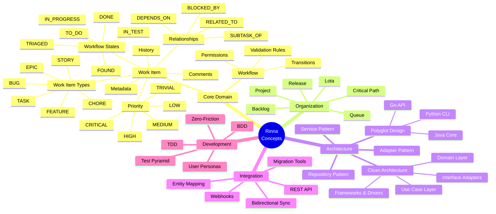
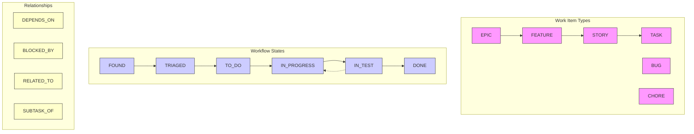
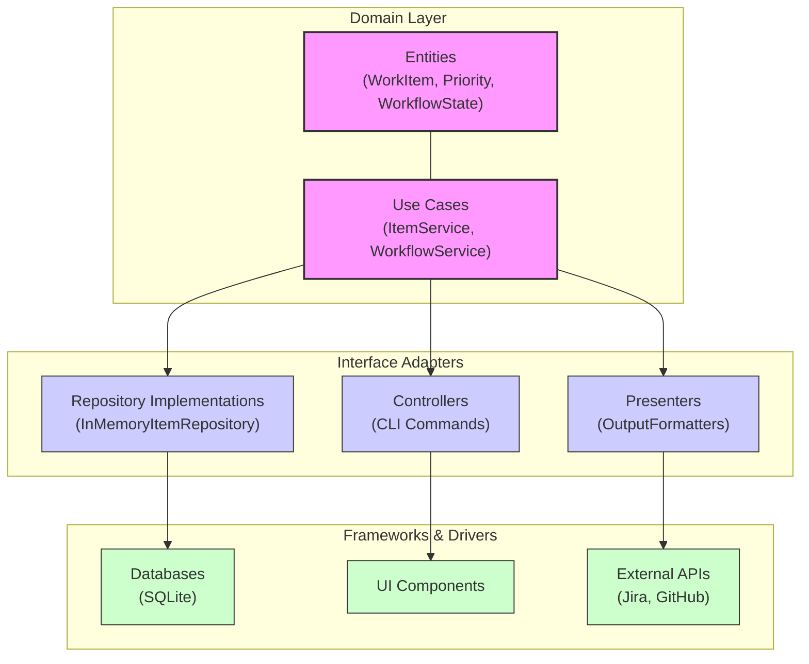
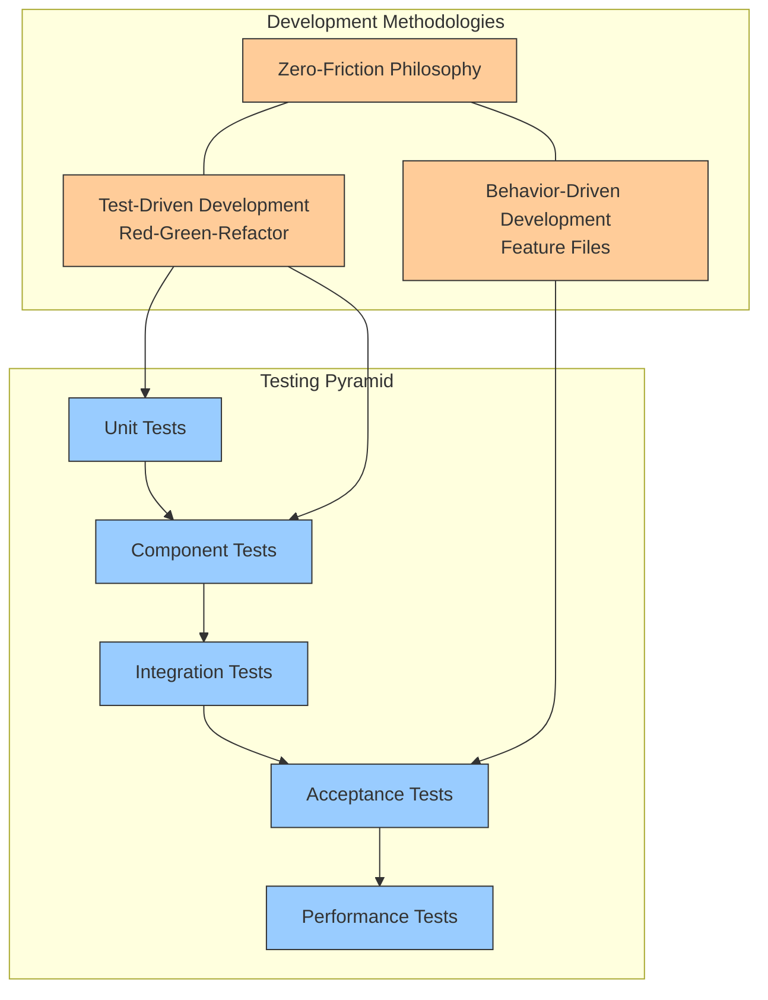

# Rinna Conceptual Categories

This diagram provides a visual representation of the key conceptual categories in Rinna and their relationships.

## Core Domain Concepts

## Workflow and Relationship Model

## Clean Architecture Layers

## Development Methodology

