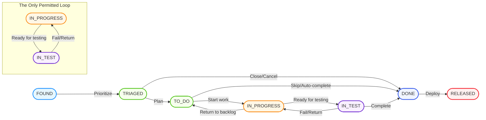

# Rinna Workflow State Diagram

This diagram illustrates the standard workflow states and transitions in the Rinna system.

## State Transition Diagram

## State Descriptions

1. **FOUND**
   - Initial state for all work items
   - Represents items that have been identified but not yet evaluated
   - Typically populated by bug reports, feature requests, or ideas

2. **TRIAGED**
   - Work items that have been reviewed and prioritized
   - Ready for inclusion in planning
   - Have enough information to make decisions about importance

3. **TO_DO**
   - Work items that are ready to be worked on
   - Included in current planning period
   - All prerequisites for implementation are satisfied

4. **IN_PROGRESS**
   - Items actively being worked on by a developer
   - Code is being written or modified
   - Typically assigned to a specific developer

5. **IN_TEST**
   - Implementation is complete
   - Item is under verification with automated or manual testing
   - May include code review, QA, or validation activities

6. **DONE**
   - Work is complete and verified
   - All acceptance criteria have been met
   - Ready for release

7. **RELEASED**
   - Item has been deployed to production
   - Available to end users
   - Final state in the workflow

## Transition Rules

- **Sequential Progression**: Items typically move through states in sequential order
- **Single Loop**: The only permitted cyclical transition is between IN_PROGRESS and IN_TEST
- **Skip Transitions**: Some items may skip intermediate states (e.g., trivial issues can go from TRIAGED to DONE)
- **Backward Transitions**: Most backward transitions are not allowed, with the key exception of the test-fail loop

## Transition Actions and Commands

| Transition | CLI Command | Description |
|------------|-------------|-------------|
| FOUND → TRIAGED | `rin triage ITEM-1` | Prioritize and prepare item for planning |
| TRIAGED → TO_DO | `rin plan ITEM-1` | Include item in current work period |
| TO_DO → IN_PROGRESS | `rin start ITEM-1` | Begin work on an item |
| IN_PROGRESS → IN_TEST | `rin ready-for-test ITEM-1` | Mark item as ready for testing |
| IN_TEST → DONE | `rin complete ITEM-1` | Mark item as complete |
| IN_TEST → IN_PROGRESS | `rin return ITEM-1` | Return item to developer after failed testing |
| DONE → RELEASED | `rin release ITEM-1` | Mark item as released to production |

## Special Transitions

1. **Cancellation Path**
   - TRIAGED → DONE: Used for items determined unnecessary after triage
   - TO_DO → DONE: Used for items no longer needed

2. **Reset Path**
   - IN_PROGRESS → TO_DO: Used when work must be deferred

## Workflow Philosophy

The Rinna workflow intentionally constrains transitions to ensure clarity and consistency. The philosophy is that a fixed workflow with clear states reduces cognitive load and improves team coordination.

For more information on why this specific workflow was chosen, see [Workflow Philosophy](../../user-guide/workflow-philosophy.md).