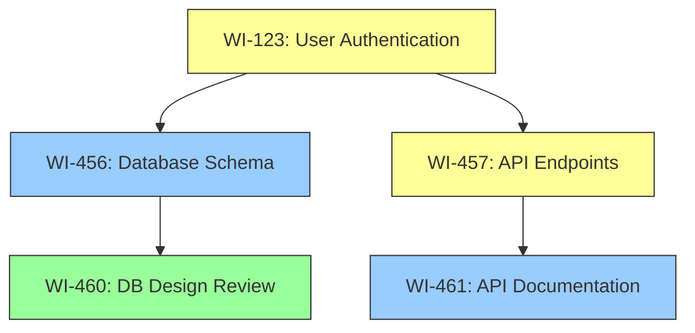
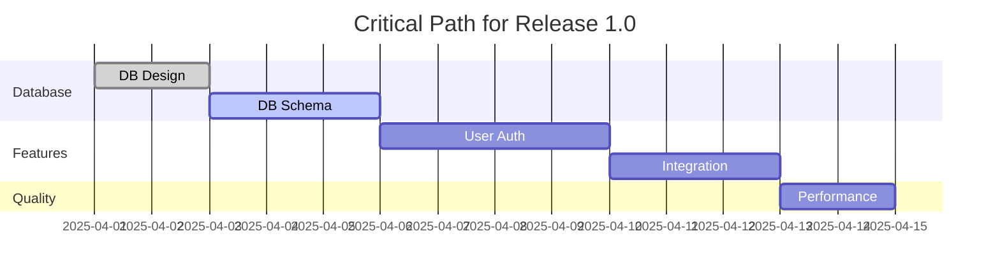

# Complex Dependency Management

This guide provides in-depth information on managing complex dependency relationships between work items in Rinna, expanding on the overview provided in the [Advanced Workflow Scenarios](advanced-workflow-scenarios.md#complex-dependency-management) document.

## Understanding Dependency Types

Rinna provides a rich set of dependency relationships to accurately model the connections between work items.

### Dependency Type Reference

| Type | Description | Effect on Workflow | CLI Example |
|------|-------------|-------------------|-------------|
| `BLOCKED_BY` | Cannot proceed until the blocking item is complete | Prevents transitions to IN_PROGRESS | `rin-cli link WI-123 BLOCKED_BY WI-456` |
| `DEPENDS_ON` | Functional dependency without hard blocking | Warning on transition to IN_PROGRESS | `rin-cli link WI-123 DEPENDS_ON WI-456` |
| `SUBTASK_OF` | Hierarchical relationship (part of larger task) | Parent cannot be DONE until all subtasks DONE | `rin-cli link WI-123 SUBTASK_OF WI-456` |
| `RELATED_TO` | Non-blocking informational relationship | No workflow effects, informational only | `rin-cli link WI-123 RELATED_TO WI-456` |
| `DUPLICATES` | Identical issue to another item | Item typically closed as duplicate | `rin-cli link WI-123 DUPLICATES WI-456` |
| `FOLLOWS` | Sequential relationship (non-blocking) | Suggests ordering but doesn't enforce | `rin-cli link WI-123 FOLLOWS WI-456` |
| `PRECEDES` | Sequential relationship (opposite of FOLLOWS) | Suggests ordering but doesn't enforce | `rin-cli link WI-123 PRECEDES WI-456` |
| `CONFLICTS_WITH` | Mutually exclusive implementations | Warning when both items IN_PROGRESS | `rin-cli link WI-123 CONFLICTS_WITH WI-456` |

## Creating and Managing Dependencies

### Creating Dependencies

Basic dependency creation:

```bash
bin/rin-cli link WI-123 DEPENDS_ON WI-456
```

Creating dependencies with additional context:

```bash
bin/rin-cli link WI-123 BLOCKED_BY WI-456 --reason "Requires database schema changes"
```

Bulk dependency creation:

```bash
bin/rin-cli link-bulk WI-123 BLOCKED_BY WI-456,WI-457,WI-458
```

Bidirectional relationships:

```bash
# Creates both relationships in a single command
bin/rin-cli link-bidirectional WI-123 RELATED_TO WI-456
```

### Viewing Dependencies

View dependencies for a specific work item:

```bash
bin/rin-cli dependencies WI-123

# With transitive dependencies (dependencies of dependencies)
bin/rin-cli dependencies WI-123 --transitive

# Focusing on specific dependency types
bin/rin-cli dependencies WI-123 --type BLOCKED_BY,DEPENDS_ON

# With depth limit for transitive dependencies
bin/rin-cli dependencies WI-123 --transitive --depth 3
```

Example output:

```
Dependencies for WI-123 (Feature: Implement user authentication)

Directly blocked by:
- WI-456 (Task: Design database schema) [IN_PROGRESS]
- WI-457 (Task: Create API endpoints) [TO_DO]

Depends on:
- WI-458 (Feature: User management module) [DONE]

Subtask of:
- WI-459 (Epic: Security improvements) [IN_PROGRESS]

Transitive dependencies:
- WI-456 → WI-460 (Task: Review database design) [DONE]
- WI-457 → WI-461 (Task: API documentation) [TO_DO]
```

### Visualizing Dependency Graphs

Generate a visual dependency graph:

```bash
# Simple visualization
bin/rin-cli dependencies WI-123 --graph

# Export as Mermaid diagram
bin/rin-cli dependencies WI-123 --graph --format mermaid --output deps.md

# Export as DOT format for Graphviz
bin/rin-cli dependencies WI-123 --graph --format dot --output deps.dot

# Complex visualization with custom options
bin/rin-cli dependencies WI-123 --graph \
  --include-types BLOCKED_BY,DEPENDS_ON \
  --show-status \
  --highlight-critical \
  --transitive --depth 3
```

### Modifying Dependencies

Update existing dependencies:

```bash
# Change dependency type
bin/rin-cli link-update WI-123 DEPENDS_ON WI-456 --new-type BLOCKED_BY

# Update reason/context
bin/rin-cli link-update WI-123 BLOCKED_BY WI-456 --reason "Updated rationale"
```

Remove dependencies:

```bash
bin/rin-cli unlink WI-123 BLOCKED_BY WI-456
```

## Advanced Dependency Features

### Critical Path Analysis

Identify the critical path through dependencies:

```bash
# For a specific work item
bin/rin-cli path WI-123

# For a release
bin/rin-cli path --release RELEASE-456

# With estimated durations
bin/rin-cli path --release RELEASE-456 --with-estimates

# Export as Gantt chart
bin/rin-cli path --release RELEASE-456 --format gantt --output critical-path.md
```

Example output:

```
Critical Path Analysis for RELEASE-456

Total Duration: 14 days
Path:
1. WI-460: Database design (2 days) [DONE]
2. WI-456: Database schema implementation (3 days) [IN_PROGRESS]
3. WI-123: User authentication (4 days) [TO_DO]
4. WI-462: Integration tests (3 days) [TO_DO]
5. WI-463: Performance optimization (2 days) [TO_DO]

Bottlenecks:
- WI-456: High complexity, single assignee
- WI-462: Requires coordination between teams
```

### Impact Analysis

Assess the impact of delays or changes:

```bash
# Impact of delaying a work item
bin/rin-cli impact-analysis WI-123 --delay 2days

# Impact of removing a work item
bin/rin-cli impact-analysis WI-123 --remove

# Impact on specific milestone or deadline
bin/rin-cli impact-analysis WI-123 --delay 2days --milestone "Beta Release"
```

### Circular Dependency Detection

Identify and resolve circular dependencies:

```bash
# Check for circular dependencies in a release
bin/rin-cli check-circular --release RELEASE-456

# Check specific work item and its dependencies
bin/rin-cli check-circular WI-123 --depth 5

# Auto-suggest resolution options
bin/rin-cli check-circular --release RELEASE-456 --suggest-fixes
```

### Dependency Validation Rules

Create custom validation rules for dependencies:

```bash
# Prevent dependencies on DONE items
bin/rin-cli rule create dependency-rule-1 \
  --condition "dependency.type = BLOCKED_BY AND dependent.status = TO_DO" \
  --constraint "dependency.status != DONE"

# Ensure all items under an Epic have assignees
bin/rin-cli rule create dependency-rule-2 \
  --condition "dependency.type = SUBTASK_OF AND dependency.type = EPIC" \
  --constraint "dependent.assignee != null"
```

## Team-Based Dependency Management

### Cross-Team Dependencies

Manage dependencies between teams:

```bash
# Create cross-team dependency
bin/rin-cli link WI-123 DEPENDS_ON WI-456 --cross-team

# List all cross-team dependencies
bin/rin-cli list-dependencies --cross-team

# List dependencies between specific teams
bin/rin-cli list-dependencies --team-1 frontend-team --team-2 backend-team
```

### Dependency Notifications

Configure notifications for dependency changes:

```bash
# Enable notifications for dependency changes
bin/rin-cli notifications enable dependency-changes

# Get notified when blocking items are complete
bin/rin-cli watch WI-123 --notify-dependency-changes

# Configure team notifications
bin/rin-cli team config frontend-team --notify-cross-team-dependencies
```

## Integration with Project Management

### Dependency Reports

Generate reports for dependency management:

```bash
# Basic dependency report
bin/rin-cli report dependencies --release RELEASE-456

# Blocked items report
bin/rin-cli report blocked-items

# Cross-team dependency report
bin/rin-cli report cross-team-dependencies

# Export to different formats
bin/rin-cli report dependencies --release RELEASE-456 --format xlsx
```

### External System Integration

Synchronize dependencies with external systems:

```bash
# Import dependencies from Jira
bin/rin-cli external import-dependencies --system jira --project PROJ

# Map external dependency types
bin/rin-cli external map-dependency-types \
  --system jira \
  --mapping "blocks:BLOCKED_BY,depends:DEPENDS_ON"

# Export dependencies to external system
bin/rin-cli external export-dependencies \
  --system jira \
  --release RELEASE-456
```

## Dependency Visualization Examples

### Simple Dependency Graph



### Critical Path Visualization



## Best Practices for Dependency Management

1. **Minimize Hard Dependencies**: Use BLOCKED_BY sparingly; prefer DEPENDS_ON when possible
2. **Keep Dependency Chains Short**: Break work into smaller pieces to reduce dependency depth
3. **Regular Dependency Audits**: Review and clean up unnecessary dependencies
4. **Clear Dependency Documentation**: Always provide a reason when creating dependencies
5. **Proactive Management**: Address blocked items quickly to unblock dependent work
6. **Cross-Team Communication**: Ensure teams are aware of dependencies on their work
7. **Dependency Metrics**: Track and reduce the average number of dependencies per work item

## Conclusion

Effective dependency management is critical for complex projects. Rinna provides comprehensive tools to create, visualize, and manage dependencies while maintaining a simple core workflow. By following the best practices outlined in this guide, teams can minimize blockers and optimize their development process.